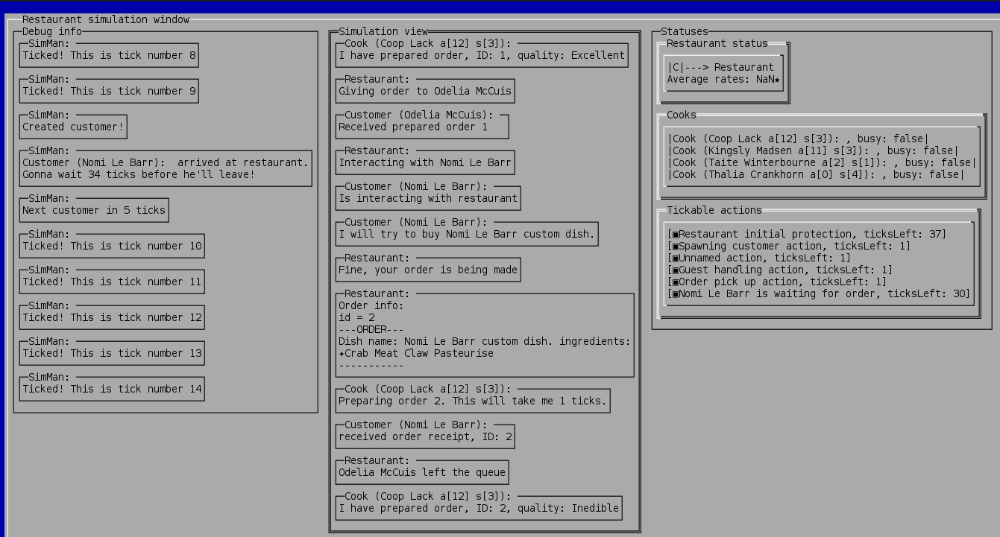

# RestaurantSim - Simple simulation of a restaurant.

Preview of simulation look

GUI was made using [Lanterna](https://github.com/mabe02/lanterna)

Simulation is tick based. When certain (random) amount of tick passes customer is generated and added to restaurant queue. Customers order dynamically composed dishes and wait for them to be ready to pick up. Based on how quickly and well the dish is made by cooks customers rate the restaurant. Simulation ends when average rate value drops under certain amount - this and many other parameters can be adjusted in *simulation_settings.json config file*.   